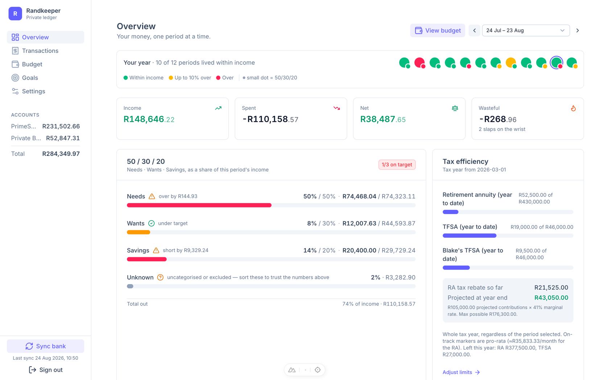
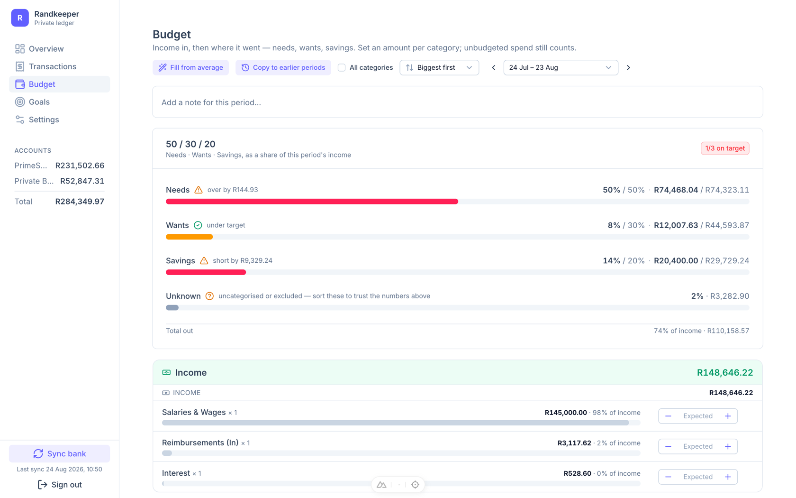
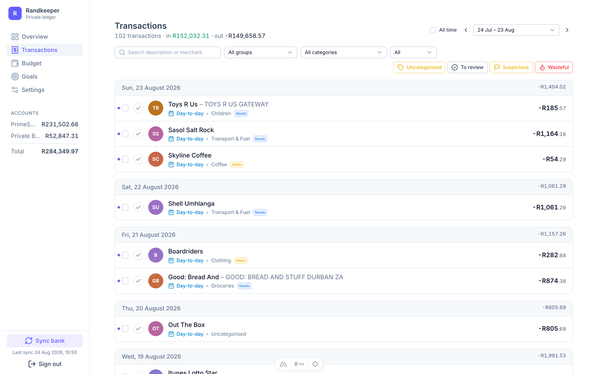
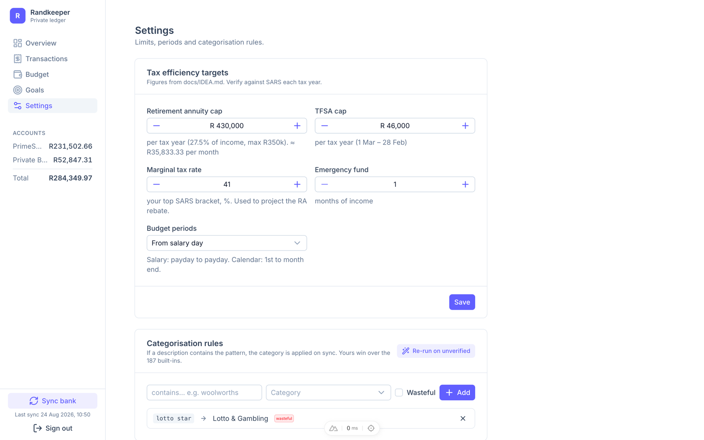

# Randkeeper

**Every rand, accounted for.** Personal finance for exactly one person: Investec transactions → categorised → budget, 50/30/20, tax efficiency, goals.

Built on the Investec Programmable Banking API. Every payday becomes a scorecard — income vs spend, the 50/30/20 rule, and the tax breaks SARS actually gives you.



> All screenshots show the bundled mock provider — six months of fake data, no real numbers.

## Features

### Your whole year in twelve dots

Each period gets a verdict the moment it ends: green if you lived within your income, amber up to 10% over, red beyond — with a second dot for how the 50/30/20 rule went. Income, spent, net, and a **Wasteful** total counted in "slaps on the wrist".

### 50/30/20, scored per payday

Every category carries a needs / wants / savings tranche, so alignment is computed live against that period's real income. Anything uncategorised shows up as **Unknown** — sort it before you trust the numbers.

- **Fill from average** — seed a budget from actual spending
- **Copy previous** and backfill earlier periods in one click
- Unbudgeted spend still counts — no hiding



### Triage, not bookkeeping

187 built-in rules recognise the merchants that actually appear in a South African bank feed — Woolworths, Sasol, Mr D, tollgates — and file each transaction into a category and tranche on sync. Your own rules always win.

- Workflow filters: **Uncategorised · To review · Suspicious · Wasteful**
- Rules can set the tranche and flag waste automatically
- Re-run on unverified without touching hand-edits



### Tuned for SARS

The tax year runs 1 March to end-Feb, like it should. Randkeeper paces your retirement annuity against the **R430k** cap (Budget 2026) and both TFSAs against theirs, and projects the RA rebate at your marginal rate — in rands, not percentages. Pro-rata markers show whether you're pacing the year; caps and marginal rate are configurable.



### Goals that fill themselves

Link a goal to a category and every matching transaction since the start date counts toward it — the emergency fund grows because you saved, not because you remembered to update a spreadsheet. Manual top-ups cover what happened off the books.

### Private by design

- **One email, six digits** — login is an OTP sent to the single address that's allowed in. No accounts, no sharing, no tracking.
- **Data stays home** — everything lives in a local SQLite file via `node:sqlite`. No cloud, no aggregator reading your bank feed.
- **Payday to payday** — budget periods start when your salary lands, detected from the feed itself. Calendar months available if you prefer.
- **Split templates** — one joint-account transfer becomes rent, groceries and utilities on every sync, with the leftover tracked too.
- **Readable in an evening** — Nuxt 4, one file per endpoint, ~1,400 lines of code.

## Running it

```sh
pnpm install
pnpm dev          # http://localhost:4100
```

1. Log in with the email in `NUXT_OWNER_EMAIL` (see `.env.example`). The 6-digit code is printed in the terminal (no email provider yet).
2. Hit **Sync bank** in the sidebar. With `NUXT_BANK_PROVIDER=mock` (the default) this loads ~6 months of fake data.

### Connecting Investec

```
NUXT_BANK_PROVIDER=investec
NUXT_INVESTEC_CLIENT_ID=...
NUXT_INVESTEC_CLIENT_SECRET=...
NUXT_INVESTEC_API_KEY=...
```

Each provider has its own database (`data/randkeeper.<provider>.db`), so mock and real data never mix. The Investec client lives in `server/utils/bank.ts` and is untested.

## Layout

- `shared/domain.ts` — spending groups, categories (with default needs/wants/savings), tax constants, money formatting
- `server/utils/` — `db.ts` (node:sqlite), `bank.ts` (provider + mock), `categorise.ts` (rules), `periods.ts` (payday-based periods), `stats.ts`
- `server/api/` — one file per endpoint
- `app/pages/` — overview, transactions, budget, goals, settings
- `docs/` — idea, category and spending-group reference, screenshots
