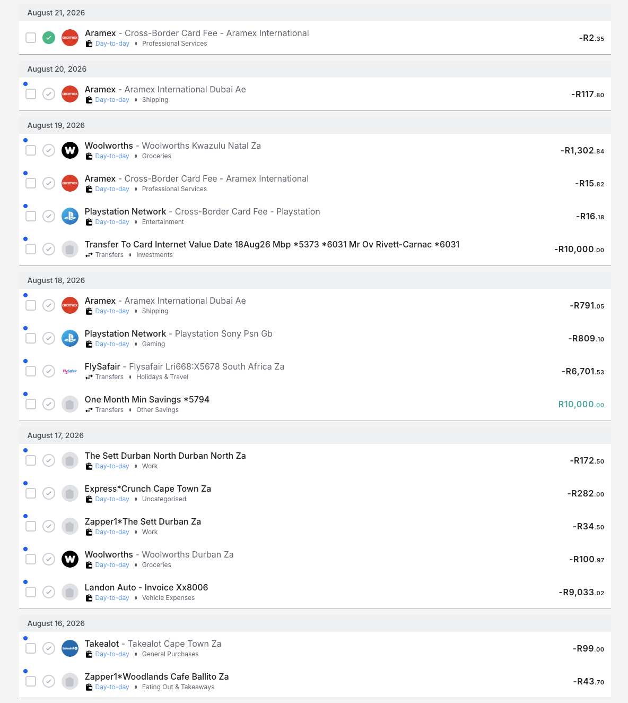

Pull data from Investec's programmable banking API 
This is only going to be for my own consumption
Still want it guarded by auth
Email authentication is fine

# API
[SA PB Account Information.yaml](SA%20PB%20Account%20Information.yaml)
https://developer.investec.com/api-reference/SA%20PB%20Account%20Information

# Transactions
Pull transactions

Each transaction can get assigned to a Spending Group, Category, Tags, Budget Period.
Maybe also a tranch (or better name) for the 50/30/20 rule (Savings, Wants, Needs).

Copy the Vault22 transaction list

Have a look at [category list](categories.md) and [spending group list](spending-groups.md) for ideas on how to categorize transactions.

Automatic categorization of transactions based on description, amount, and other metadata.

# Budgeting

Need to be able to set and update a budget a period. Start end... or do we do a smart budget period looking for salary as the beginning?
Maybe we need to have budget periods?

# 50/30/20
For each month I want to see my alignment with the 50/30/20 based on my income
> The 50/30/20 rule is a balanced budgeting guideline which says to spend 50% of your after-tax income on needs, 30% on wants, and 20% on savings.

https://www.investec.com/en_za/focus/investing-in-life/spend-or-save-the-50-30-20-rule.html

Keeping Needs below is good. Going over needs a warning.
Keep Wants below is good. Going over wants a warning.
Keep Savings above is good. Going under savings a warning.

# Tax efficiency

Chips meantioned that I am not being optimal on my tax efficiency
I need to find out what is optimal, then allow that to be configurable 
Then show how close to optimal I am being as part of my overview
per month? or per annum?

Looks to be R35,833 p/m for RA contribution, and R46,000 p/a for TFSA contribution.

# Wasteful

I want a tag for wasteful expenditure and then be able to keep myself accountable and tag my transactions as a slap on my own wrist.

# Goals

Be able to set myself a goal. 
E.g 
- emergency fund that I get to choose the amount although it should be 1 months salary.
- tfsa contribution
- half blakes tfsa contribution

# Tech Stack 

Same stack as /Users/oliver/Dev/GitHub/oliverrc/not-a-ticketing-system

Nuxt, NuxtUI, Tailwind
But not going to host on Cloudflare, just run it locally for now so probably SQLLite or equivalent for local storage.

# UI

I used to be very happy with 22Seven / Vault22. Their UI is not for budgeting and transactions so we can use them a reference and improve upon.

